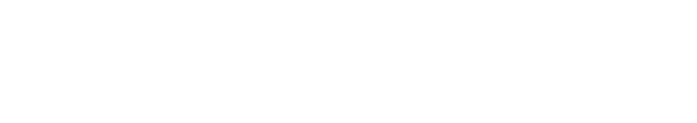

# SeekBar | Alex Zarazua & Vicent Coll

  

## INDEX

* Getting Started
* About this project
* Preview 
* Features
* Built With and technologies

## Getting Started 

* You have the instructions in this files.

* BACKEND /helps 
* FRONTEND /helps

* But you also can do this : 
     * 1.- Clone this repo
     * 2.- Install Docker Community Edition : 
     * 3.-Run this command in the terminal : ` docker-compose up --build `

    
## About this project

## Preview

## Features

 

## Built With

 * Djanfgo Rest FrameWork
 * Vuex--Version 4.0.0-0
 * Vue-Version 3.0.0
 * @ionic/vue: "^5.6.4",
 * ionicons: "^5.5.1",
 * Docker
 * Docker-Compose
 * PostGre
 * PgAdmin
 * PostMan

## Other Technologies

 * JWT
 * CSS3
 * Axios

  <h3 align="center"><strong>&copy; SeekBar 2021</strong></h3>

